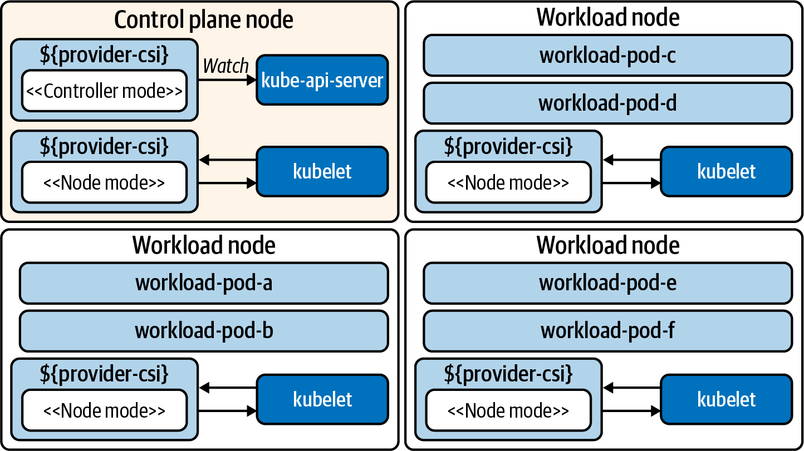

# The Container Storage Interface (CSI)

## I. Overview
```
The Container Storage Interface is the answer to how we provide block and file storage to our workloads. The implementations of CSI are referred to as drivers, which have the operational knowledge for talking to storage providers. These providers span from cloud systems such as Google Persistent Disks to storage systems (such as Ceph) deployed and managed by you. The drivers are implemented by storage providers in projects that live out-of-tree. They can be entirely managed out of band from the cluster they are deployed within.

At a high level, CSI implementations feature a controller plug-in and a node plug-in. CSI driver developers have a lot of flexibility in how they implement these components. Typically, implementations bundle the controller and node plug-ins in the same binary and enable either mode via an environment variable such as X_CSI_MODE. The only expectations are that the driver registers with the kubelet and the endpoints in the CSI specification are implemented.

The controller service is responsible for managing the creation and deletion of volumes in the storage provider. This functionality extends into (optional) features such as taking volume snapshots and expanding volumes. The node service is responsible for preparing volumes to be consumed by Pods on the node. Often this means setting up the mounts and reporting information about volumes on the node. Both the node and controller service also implement identity services that report plug-in info, capabilities, and whether the plug-in is healthy. With this in mind, Figure 4-1 represents a cluster architecture with these components deployed.
```



## II. CSI Controller
The CSI Controller service provides APIs for managing volumes in a persistent storage system. The Kubernetes control plane does not interact with the CSI Controller service directly. Instead, controllers maintained by the Kubernetes storage community react to Kubernetes events and translate them into CSI instructions, such as CreateVolumeRequest when a new PersistentVolumeClaim is created. Because the CSI Controller service exposes its APIs over UNIX sockets, the controllers are usually deployed as sidecars alongside the CSI Controller service. There are multiple external controllers, each with different behavior:


### `external-provisioner`
```
When PersistentVolumeClaims are created, this requests a volume be created from the CSI driver. Once the volume is created in the storage provider, this provisioner creates a PersistentVolume object in Kubernetes.
```

### `external-attacher`
```
Watches the VolumeAttachment objects, which declare that a volume should be attached or detached from a node. Sends the attach or detach request to the CSI driver.
```

### `external-resizer`
```
Detects storage-size changes in PersistentVolumeClaims. Sends requests for expansion to the CSI driver.
```

### `external-snapshotter`
```
When VolumeSnapshotContent objects are created, snapshot requests are sent to the driver.
```

**Note**
When implementing CSI plug-ins, developers are not required to use the aforementioned controllers. However, their use is encouraged to prevent duplication of logic in every CSI plug-in.

## II. CSI Node

The Node plug-in typically runs the same driver code as the controller plug-in. However, running in the “node mode” means it is focused on tasks such as mounting attached volumes, establishing their filesystem, and mounting volumes to Pods. Requests for these behaviors is done via the kubelet. Along with the driver, the following sidecars are often included in the Pod:

### `node-driver-registrar`
```
Sends a registration request to the kubelet to make it aware of the CSI driver.
```

### `liveness-probe`
```
Reports the health of the CSI driver.
```
