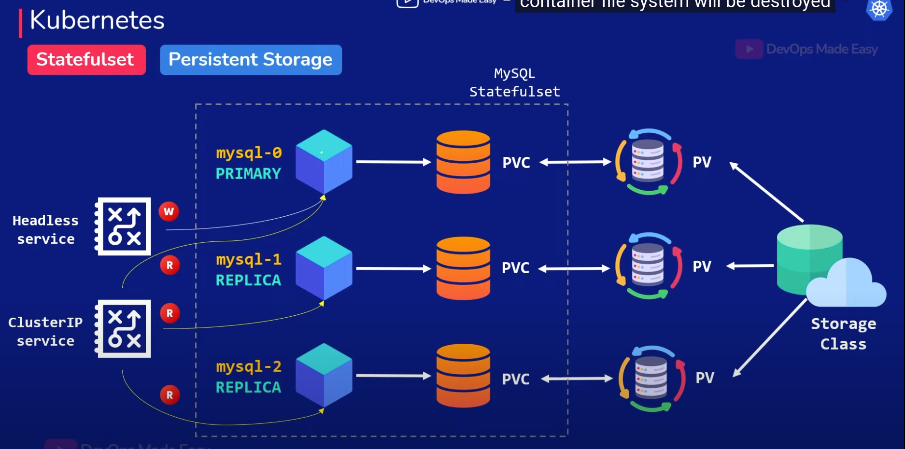

# Config mysql statefulset

https://loft.sh/blog/kubernetes-statefulset-examples-and-best-practices/



<hr/>
## Remember that while Kubernetes helps you set up a stateful application, you will need to set up the data cloning and data sync by yourself. This cannot be done by the StatefulSets.
<hr/>

### apply config:
```
kubectl apply -f longhorn-retain-storage.yml

kubectl apply -f mysql-secret.yml

kubectl apply -f mysql-service.yml

kubectl apply -f mysql-statefulset.yml
```

### testing nslookup:
```
# start pod:
kubectl run -it --rm testing-pod --image nginx:alpine -- sh
```

### check headless service:

```
# command
nslookup mysql-headless-service.default.svc.cluster.local

# Result is Pod's IP

Server:		10.96.0.10
Address:	10.96.0.10:53


Name:	mysql-headless-service.default.svc.cluster.local
Address: 10.244.3.49
Name:	mysql-headless-service.default.svc.cluster.local
Address: 10.244.2.164
```
### check normal service:

```
# command
nslookup mysql-headless-service.default.svc.cluster.local

# Result is Service's IP

Server:		10.96.0.10
Address:	10.96.0.10:53


Name:	mysql-normal-service.default.svc.cluster.local
Address: 10.107.248.94

```

### testing connect:
```
kubectl apply -f mysql-client.yml

kubectl exec -it mysql-client -- /bin/sh

apk add mysql-client

mysql -h mysql-set-0.mysql.default.svc.cluster.local -u'duongdx' -p'duongdx1'
```

### if connect mysql error:
```
# going to mysql server and edit mysql user

ALTER USER 'duongdx'@'%' IDENTIFIED WITH 'mysql_native_password' BY 'duongdx1';
```


